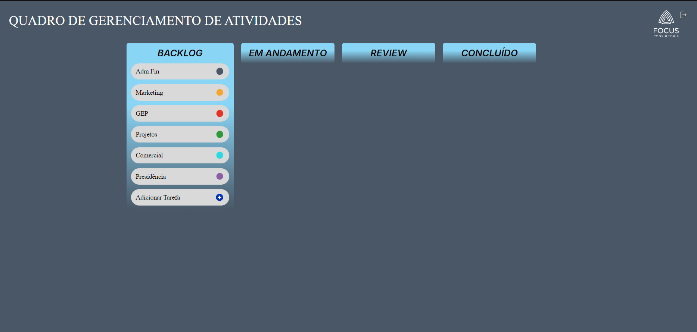
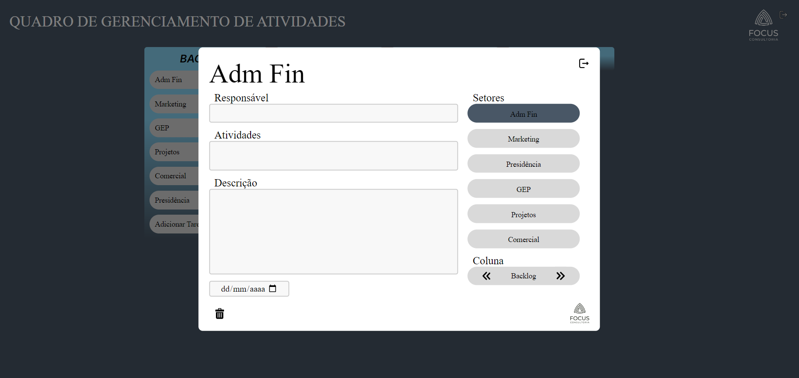

## Indice
- [Autor](#autor)
- [Estrutura Kanban](#estrutura-kanban---período-trainee)
## Autor

<a href="https://www.linkedin.com/in/joão-moura-7ab135209">
 
  
 <b>João Paulo de Moura</b></a> 
  

## Estrutura kanban - Período Trainee
Este projeto foi desenvolvido durante o período trainee da Focus Consultoria e idealizado para atender às necessidades de um cliente que buscava implementar a metodologia ágil Kanban. O desafio consistia em criar uma plataforma funcional e responsiva, onde fosse possível gerenciar tarefas de forma intuitiva e organizada. A aplicação permite que os usuários criem, editem e movam cartões entre diferentes colunas do fluxo de trabalho, representando o progresso das atividades. O projeto foi desenvolvido com foco em usabilidade e performance, garantindo uma experiência completa para a gestão de tarefas ágeis. [Clique aqui](https://jpaulo-mrs.github.io/Kanban/) para acessar a página.

